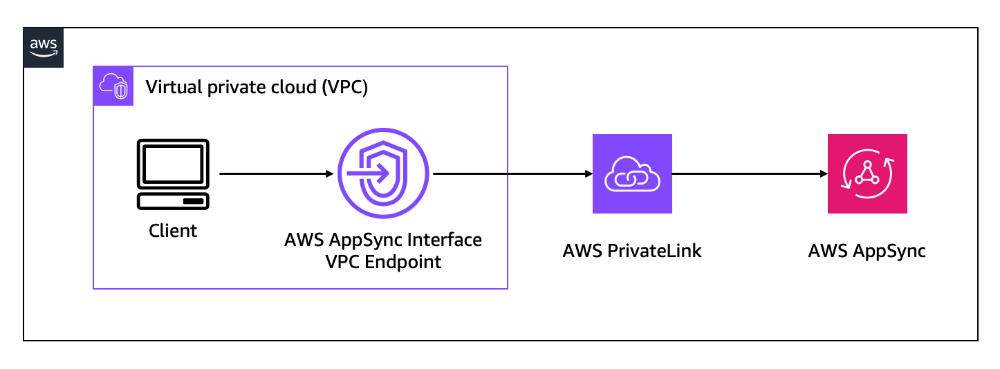

# AWS AppSync Private API

This pattern shows how you can deploy an AWS AppSync Private API which can only be invoked by resources within your private network. AWS AppSync Private APIs helps customers to restrict access to GraphQL APIs to API consumers within a private network, such as Amazon Virtual Private Cloud (VPC) or hybrid environment. To deploy the provided SAM template, provide the VPC ID and Subnet ID as parameters which will be where the AppSync Interface VPC endpoint will be deployed. It is recommended to provide 2 or more subnet IDs for high availability. This implementation will support all GraphQL `queries`, `mutations` and `subscriptions` defined in the AppSync API GraphQL schema. To demonstrate this pattern, the template will deploy a simple Restaurant API with Amazon DynamoDB as a data source.

Learn more about this pattern at Serverless Land Patterns: https://serverlessland.com/patterns/apigateway-appsync-dynamodb-sam

Important: this application uses various AWS services and there are costs associated with these services after the Free Tier usage - please see the [AWS Pricing page](https://aws.amazon.com/pricing/) for details. You are responsible for any AWS costs incurred. No warranty is implied in this example.

## Requirements

- [Create an AWS account](https://portal.aws.amazon.com/gp/aws/developer/registration/index.html) if you do not already have one and log in. The IAM user that you use must have sufficient permissions to make necessary AWS service calls and manage AWS resources.
- [AWS CLI](https://docs.aws.amazon.com/cli/latest/userguide/install-cliv2.html) installed and configured
- [Git Installed](https://git-scm.com/book/en/v2/Getting-Started-Installing-Git)
- [AWS Serverless Application Model](https://docs.aws.amazon.com/serverless-application-model/latest/developerguide/serverless-sam-cli-install.html) (AWS SAM) installed
- [Create a VPC and Subnets](https://docs.aws.amazon.com/vpc/latest/userguide/create-vpc.html) to deploy the AppSync Interface VPC Endpoint or to test out the pattern, you can use the default VPC in each region. Use commands below to identify the default VPC ID and Subnet IDs

```
aws ec2 describe-vpcs --filters Name=isDefault,Values=true --query "Vpcs[0].VpcId" --output text
```

```
aws ec2 describe-subnets --filters "Name=vpc-id,Values=vpc-xxxxxxxxxxx" --query "Subnets[*].SubnetId" --output json
```

## Deployment Instructions

1. Create a new directory, navigate to that directory in a terminal and clone the GitHub repository:
   ```
   git clone https://github.com/aws-samples/serverless-patterns
   ```
2. Change directory to the pattern directory:
   ```
   cd appsync-private-api-same
   ```
3. From the command line, use AWS SAM to deploy the AWS resources for the pattern as specified in the template.yml file:
   ```
   sam deploy --guided
   ```
4. During the prompts:

   - Enter a stack name
   - Enter the desired AWS Region
   - Allow SAM CLI to create IAM roles with the required permissions.

   Once you have run `sam deploy --guided` mode once and saved arguments to a configuration file (samconfig.toml), you can use `sam deploy` in future to use these defaults.

5. Note the outputs from the SAM deployment process. Two of the outputs `AppSync GraphQL API URL` and `AppSync VPC Endpoint DNS` will be used to test this pattern.

## How it works

This patterns creates and AppSync Interface VPC Endpoint and a sample AppSync Private API backed with a DynamoDB data source. Requests to AppSync Private APIs will go through AWS’s private network without going over the internet. GraphQL requests from your application are routed via the interface VPC endpoint to AppSync Private API. Interface VPC endpoint is powered by [AWS PrivateLink](https://aws.amazon.com/privatelink/), a highly available, scalable technology that enables you to privately connect your VPC to AWS services like AWS AppSync as if the services were in your VPC. The diagram below shows a high level architecture of private API with AWS AppSync.



API Key is used as the authorization mode for the AppSync API however it is not recommended to use API Key for production application, kindly refer to other authorization modes supported by AppSync in the [documentation](https://docs.aws.amazon.com/appsync/latest/devguide/security-authz.html)

## Testing

You can easily test this pattern using any command prompt that supports the `curl` command. Refer to the outputs `AppSyncApiUrl`, `AppSyncApiKey` and `AppSyncVPCEndpointDNS` from deploying the SAM application which will be used for testing.

1. Create a resource (for example EC2 instance) within your private network to invoke the AppSync API
2. Open your command prompt where you can run a `curl` commands
3. To add a new restaurant entry to the Restaurant API, run the `curl` command below by pasting it in your command prompt. Remember to replace the values for `{AppSyncGraphQLAPIURL}`, `{AppSyncApiKey}` and `{AppSyncVPCEndpointDNS}` which are part of the output generated after deploying the SAM template.

Note: You can either use the `AppSync GraphQL API URL` or `AppSync VPC Interface Endpoint DNS` to invoke the API as show below. You can refer to the blog [Architecture Patterns for AWS AppSync Private APIs](<https://aws.amazon.com/blogs/mobile/architecture-patterns-for-aws-appsync-private-apis/#:~:text=invoking%20graphql%20operations%20(queries%2C%20mutations%20and%20subscriptions)%20on%20appsync%20private%20apis>) for further guidance

-- Using AppSync GraphQL API URL (enabled by Private DNS settings = Yes)

```curl {AppSyncGraphQLAPIURL} \
   -H "Content-Type:application/graphql" \
   -H "x-api-key:da2-{AppSyncApiKey}" \
   -d '{"query": "query MyQuery {listRestaurants {items {name state restaurantId zip cuisine }}}","variables":"{}"}'
```

-- Using AppSync VPC Interface Endpoint DNS (you will need to pass the`AppSyncGraphQLAPIURL` in the host header, remember to remove suffix `www.`)

```curl https://{AppSyncVPCEndpointDNS}/graphql \
   -H "Host:{AppSyncGraphQLAPIURL}" \
   -H "Content-Type:application/graphql" \
   -H "x-api-key:da2-{AppSyncApiKey}" \
   -d '{"query": "query MyQuery {listRestaurants {items {name state restaurantId zip cuisine }}}","variables":"{}"}'
```

4. Refer to the blog [Architecture Patterns for AWS AppSync Private APIs](<https://aws.amazon.com/blogs/mobile/architecture-patterns-for-aws-appsync-private-apis/#:~:text=invoking%20graphql%20operations%20(queries%2C%20mutations%20and%20subscriptions)%20on%20appsync%20private%20apis>) for further examples on how to test out GraphQL subscriptions.

## Cleanup

1. Delete the stack
   ```bash
   sam delete
   ```

---

Copyright 2024 Amazon.com, Inc. or its affiliates. All Rights Reserved.

SPDX-License-Identifier: MIT-0
